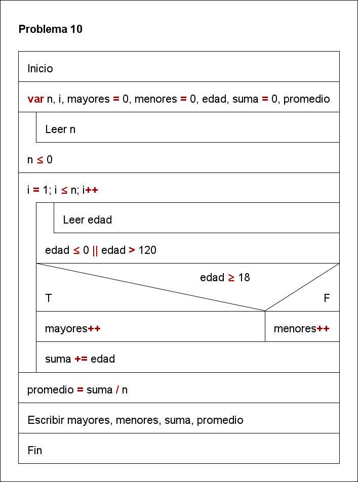

# ALGORITMOS REPETITIVOS I 🧠

Presentar **informe**, que incluye para cada pregunta, **análisis del problema, diseño de un algoritmo utilizando diagrama N-S y código en java.**

[](https://unsplash.com/photos/04X1Yp9hNH8/download?force=true&w=1080)

## Ejercicios 📝

1. **Ingrese N números positivos y calcule su promedio.**

- Análisis del problema:

  - **Datos de entrada:** n, numero
  - **Datos de salida:** promedio
  - **Proceso:**

- Diseño del algoritmo utilizando diagrama N-S:

  

- Código en java:

```java
// importamos la libreria Scanner
import java.util.Scanner;

public class ejercicio1 {
  public static void main(String[] args) {
    // creamos el objeto Scanner
    Scanner sc = new Scanner(System.in);

    // declaramos las variables
    int n, i, suma = 0, numero;
    double promedio;

    // ingresamos el valor de N
    System.out.print("Ingrese el número de números a promediar: ");
    n = sc.nextInt();

    // validamos que N sea positivo
    while (n <= 0) {
      System.out.print("El valor debe ser positivo. Ingrese nuevamente: ");
      n = sc.nextInt();
    }

    // ingresamos los N números
    for (i = 1; i <= n; i++) {
      System.out.print("Ingrese el número " + i + ": ");

      // validamos que el número sea positivo
      do {
        numero = sc.nextInt();

        if (numero < 0) {
          System.out.print("El número debe ser positivo. Ingrese nuevamente: ");
        }
      } while (numero < 0);

      // sumamos el número ingresado
      suma += numero;
    }

    // calculamos el promedio
    promedio = (double) suma / n;

    // mostramos el resultado
    System.out.println("El promedio de los " + n + " números ingresados es: " + promedio);

    // cerramos el objeto Scanner
    sc.close();
  }
}
```

- Ejecución del programa:

```bash
Ingrese el número de números a promediar: 5

Ingrese el número 1: 10
Ingrese el número 2: 20
Ingrese el número 3: 30
Ingrese el número 4: 40
Ingrese el número 5: 50

El promedio de los 5 números ingresados es: 30.0
```

2. **Programa que ingrese el precio de N productos y reporte la suma de los precios.**

- Análisis del problema:

  - **Datos de entrada:** n, precio
  - **Datos de salida:** suma
  - **Proceso:**

- Diseño del algoritmo utilizando diagrama N-S:

  

- Código en java:

```java
// importamos la libreria Scanner
import java.util.Scanner;

public class ejercicio2 {
  public static void main(String[] args) {
    // creamos el objeto Scanner
    Scanner sc = new Scanner(System.in);

    // declaramos las variables
    int n, i;
    double suma = 0, precio;

    // ingresamos el valor de N
    System.out.print("Ingrese el número de productos: ");
    n = sc.nextInt();

    // validamos que N sea positivo
    while (n <= 0) {
      System.out.print("El valor debe ser positivo. Ingrese nuevamente: ");
      n = sc.nextInt();
    }

    // ingresamos los N precios
    for (i = 1; i <= n; i++) {
      System.out.print("Ingrese el precio del producto " + i + ": ");
      precio = sc.nextDouble();

      // validamos que el precio sea positivo
      while (precio < 0) {
        System.out.print("El precio debe ser positivo. Ingrese nuevamente: ");
        precio = sc.nextDouble();
      }

      // sumamos el precio ingresado
      suma += precio;
    }

    // mostramos el resultado
    System.out.println("La suma de los precios de los " + n + " productos es: " + suma);

    // cerramos el objeto Scanner
    sc.close();
  }
}
```

- Ejecución del programa:

```bash
Ingrese el número de productos: 3

Ingrese el precio del producto 1: 10
Ingrese el precio del producto 2: 20
Ingrese el precio del producto 3: 30

La suma de los precios de los 3 productos es: 60.0
```

3. **Escribir un programa que lea el nombre de N alumnos con su respectiva edad y al final reporte la suma de las edades.**

- Análisis del problema:

  - **Datos de entrada:** n, nombre, edad
  - **Datos de salida:** suma
  - **Proceso:**

- Diseño del algoritmo utilizando diagrama N-S:

  

- Código en java:

```java
// importamos la libreria Scanner
import java.util.Scanner;

public class ejercicio3 {
  public static void main(String[] args) {
    // creamos el objeto Scanner
    Scanner sc = new Scanner(System.in);

    // declaramos las variables
    String nombre;
    int n, i, edad, suma = 0;

    // ingresamos el valor de N
    System.out.print("Ingrese el número de alumnos: ");
    n = sc.nextInt();

    // validamos que N sea positivo
    while (n <= 0) {
      System.out.print("El valor debe ser positivo. Ingrese nuevamente: ");
      n = sc.nextInt();
    }

    // ingresamos los N números
    for (i = 1; i <= n; i++) {
      System.out.print("Ingrese el nombre del alumno " + i + ": ");
      nombre = sc.next();

      System.out.print("Ingrese la edad del alumno " + nombre + ": ");
      edad = sc.nextInt();

      // validamos que la edad sea positiva
      while (edad <= 0) {
        System.out.print("La edad debe ser positiva. Ingrese nuevamente: ");
        edad = sc.nextInt();
      }

      // sumamos las edades
      suma += edad;
    }

    // mostramos el resultado
    System.out.println("La suma de las edades de los " + n + " alumnos es: " + suma);

    // cerramos el objeto Scanner
    sc.close();
  }
}
```

- Ejecución del programa:

```bash
Ingrese el número de alumnos: 3
Ingrese el nombre del alumno 1: Juan
Ingrese la edad del alumno Juan: 20
Ingrese el nombre del alumno 2: Pedro
Ingrese la edad del alumno Pedro: 30
Ingrese el nombre del alumno 3: Luis
Ingrese la edad del alumno Luis: 40

La suma de las edades de los 3 alumnos es: 90
```

4. **Escribir un programa que lea el nombre de N alumnos cada uno con su nota y al final reporte la nota promedio.**

- Análisis del problema:

  - **Datos de entrada:** n, nombre, nota
  - **Datos de salida:** promedio
  - **Proceso:**

- Diseño del algoritmo utilizando diagrama N-S:

  

- Código en java:

```java
// importamos la libreria Scanner
import java.util.Scanner;

public class ejercicio4 {
  public static void main(String[] args) {
    // creamos el objeto Scanner
    Scanner sc = new Scanner(System.in);

    // declaramos las variables
    String nombre;
    int n, i, nota, suma = 0;
    double promedio;

    // ingresamos el valor de N
    System.out.print("Ingrese el número de alumnos: ");
    n = sc.nextInt();

    // validamos que N sea positivo
    while (n <= 0) {
      System.out.print("El valor debe ser positivo. Ingrese nuevamente: ");
      n = sc.nextInt();
    }

    // ingresamos los N números
    for (i = 1; i <= n; i++) {
      System.out.print("Ingrese el nombre del alumno " + i + ": ");
      nombre = sc.next();

      System.out.print("Ingrese la nota del alumno " + nombre + ": ");
      nota = sc.nextInt();

      // validamos que la nota sea positiva y este entre 0 y 20
      while (nota < 0 || nota > 20) {
        System.out.print("La nota debe ser positiva y estar entre 0 y 20. Ingrese nuevamente: ");
        nota = sc.nextInt();
      }

      // sumamos las notas
      suma += nota;
    }

    // calculamos el promedio
    promedio = (double) suma / n;

    // mostramos el resultado
    System.out.println("El promedio de las notas de los " + n + " alumnos es: " + promedio);

    // cerramos el objeto Scanner
    sc.close();
  }
}
```

- Ejecución del programa:

```bash
Ingrese el número de alumnos: 3

Ingrese el nombre del alumno 1: Juan
Ingrese la nota del alumno Juan: 20
Ingrese el nombre del alumno 2: Pedro
Ingrese la nota del alumno Pedro: 30
La nota debe ser positiva y estar entre 0 y 20. Ingrese nuevamente: 15
Ingrese el nombre del alumno 3: Luis
Ingrese la nota del alumno Luis: 40
La nota debe ser positiva y estar entre 0 y 20. Ingrese nuevamente: 10

El promedio de las notas de los 3 alumnos es: 15.0
```

5. **Escribir un programa que ingrese la edad y la nota de N alumnos y reporte la suma de las edades y la suma de las notas.**

- Análisis del problema:

  - **Datos de entrada:** n, edad, nota
  - **Datos de salida:** sumaEdades, sumaNotas
  - **Proceso:**

- Diseño del algoritmo utilizando diagrama N-S:

  

- Código en java:

```java
// importamos la libreria Scanner
import java.util.Scanner;

public class ejercicio5 {
  public static void main(String[] args) {
    // creamos el objeto Scanner
    Scanner sc = new Scanner(System.in);

    // declaramos las variables
    int n, i, edad, nota, sumaEdades = 0, sumaNotas = 0;

    // ingresamos el valor de N
    System.out.print("Ingrese el número de alumnos: ");
    n = sc.nextInt();

    // validamos que N sea positivo
    while (n <= 0) {
      System.out.print("El valor debe ser positivo. Ingrese nuevamente: ");
      n = sc.nextInt();
    }

    // ingresamos los N números
    for (i = 1; i <= n; i++) {
      System.out.print("Ingrese la edad del alumno " + i + ": ");
      edad = sc.nextInt();

      // validamos que la edad sea positiva y menor a 120
      while (edad <= 0 || edad > 120) {
        System.out.print("La edad debe ser positiva y menor a 120. Ingrese nuevamente: ");
        edad = sc.nextInt();
      }

      // ingresamos la nota del alumno
      System.out.print("Ingrese la nota del alumno " + i + ": ");
      nota = sc.nextInt();

      // validamos que la nota sea positiva y menor a 20
      while (nota < 0 || nota > 20) {
        System.out.print("La nota debe ser positiva y menor a 20. Ingrese nuevamente: ");
        nota = sc.nextInt();
      }

      // sumamos las edades y las notas
      sumaEdades += edad;
      sumaNotas += nota;
    }

    // mostramos los resultados
    System.out.println("La suma de las edades de los " + n + " alumnos es: " + sumaEdades);
    System.out.println("La suma de las notas de los " + n + " alumnos es: " + sumaNotas);

    // cerramos el objeto Scanner
    sc.close();
  }
}
```

- Ejecución del programa:

```bash
Ingrese el número de alumnos: 3

Ingrese la edad del alumno 1: 20
Ingrese la nota del alumno 1: 15
Ingrese la edad del alumno 2: 30
Ingrese la nota del alumno 2: 20
Ingrese la edad del alumno 3: 40
Ingrese la nota del alumno 3: 10

La suma de las edades de los 3 alumnos es: 90
La suma de las notas de los 3 alumnos es: 45
```

6. **Escribir un programa que lea Nombre, cantidad y precio de N productos y reporte cuanto se debe pagar en total.**

- Análisis del problema:

  - **Datos de entrada:** n, nombre, cantidad, precio
  - **Datos de salida:** total
  - **Proceso:**

- Diseño del algoritmo utilizando diagrama N-S:

  

- Código en java:

```java
// importamos la libreria Scanner
import java.util.Scanner;

public class ejercicio6 {
  public static void main(String[] args) {
    // creamos el objeto Scanner
    Scanner sc = new Scanner(System.in);

    // declaramos las variables
    String nombre;
    int n, i, cantidad;
    double precio, total = 0;

    // ingresamos el valor de N
    System.out.print("Ingrese el número de productos: ");
    n = sc.nextInt();

    // validamos que N sea positivo
    while (n <= 0) {
      System.out.print("El valor debe ser positivo. Ingrese nuevamente: ");
      n = sc.nextInt();
    }

    // ingresamos los N productos
    for (i = 1; i <= n; i++) {
      // ingresamos el nombre del producto
      System.out.print("Ingrese el nombre del producto " + i + ": ");
      nombre = sc.next();

      // ingresamos la cantidad del producto
      System.out.print("Ingrese la cantidad del producto " + nombre + ": ");
      cantidad = sc.nextInt();

      // validamos que la cantidad sea positiva
      while (cantidad <= 0) {
        System.out.print("La cantidad debe ser positiva. Ingrese nuevamente: ");
        cantidad = sc.nextInt();
      }

      // ingresamos el precio del producto
      System.out.print("Ingrese el precio del producto " + nombre + ": ");
      precio = sc.nextDouble();

      // validamos que el precio sea positivo
      while (precio <= 0) {
        System.out.print("El precio debe ser positivo. Ingrese nuevamente: ");
        precio = sc.nextDouble();
      }

      // sumamos el total
      total += cantidad * precio;
    }

    // mostramos el total
    System.out.println("El total a pagar por los " + n + " productos es: " + total);

    // cerramos el objeto Scanner
    sc.close();
  }
}
```

- Ejecución del programa:

```bash
Ingrese el número de productos: 3

Ingrese el nombre del producto 1: Manzana
Ingrese la cantidad del producto Manzana: 2
Ingrese el precio del producto Manzana: 2.5
Ingrese el nombre del producto 2: Naranja
Ingrese la cantidad del producto Naranja: 3
Ingrese el precio del producto Naranja: 1.5
Ingrese el nombre del producto 3: Pera
Ingrese la cantidad del producto Pera: 4
Ingrese el precio del producto Pera: 3.5

El total a pagar por los 3 productos es: 23.0
```

7. **N personas van a un restaurant, piden la carta y cada uno de ellos consumen dos platos uno de precio X y otro de precio Y, más una bebida de precio Z. Si al consumo total se le agrega el 18% por concepto de IGV. 쮺uánto se paga en total por las N personas?**

- Análisis del problema:

  - **Datos de entrada:** n, x, y, z
  - **Datos de salida:** total
  - **Proceso:**

- Diseño del algoritmo utilizando diagrama N-S:

  

- Código en java:

```java
// importamos la libreria Scanner
import java.util.Scanner;

public class ejercicio7 {
  public static void main(String[] args) {
    // creamos el objeto Scanner
    Scanner sc = new Scanner(System.in);

    // declaramos las variables
    int n, i;
    double x, y, z, suma = 0, total;

    // ingresamos el valor de N
    System.out.print("Ingrese el número de personas: ");
    n = sc.nextInt();

    // validamos que N sea positivo
    while (n <= 0) {
      System.out.print("El valor debe ser positivo. Ingrese nuevamente: ");
      n = sc.nextInt();
    }

    // pedimos el precio de X, Y y Z
    for (i = 1; i <= n; i++) {
      // ingresamos el precio de X
      System.out.print("Ingrese el precio X del primer plato de la persona " + i + ": ");
      x = sc.nextDouble();

      // validamos que el precio de X sea positivo
      while (x <= 0) {
        System.out.print("El precio de X debe ser positivo. Ingrese nuevamente: ");
        x = sc.nextDouble();
      }

      // ingresamos el precio de Y
      System.out.print("Ingrese el precio de Y del segundo plato de la persona " + i + ": ");
      y = sc.nextDouble();

      // validamos que el precio de Y sea positivo
      while (y <= 0) {
        System.out.print("El precio de Y debe ser positivo. Ingrese nuevamente: ");
        y = sc.nextDouble();
      }

      // ingresamos el precio de Z
      System.out.print("Ingrese el precio de Z de la bebida de la persona " + i + ": ");
      z = sc.nextDouble();

      // validamos que el precio de Z sea positivo
      while (z <= 0) {
        System.out.print("El precio de Z debe ser positivo. Ingrese nuevamente: ");
        z = sc.nextDouble();
      }

      // sumamos el total
      suma += x + y + z;
    }

    // calculamos el total
    total = suma + (suma * 0.18);

    // mostramos el total
    System.out.println("El total a pagar por las " + n + " personas es: " + total);

    // cerramos el objeto Scanner
    sc.close();
  }
}
```

- Ejecución del programa:

```bash
Ingrese el número de personas: 3

Ingrese el precio de X del primer plato de la persona 1: 10
Ingrese el precio de Y del segundo plato de la persona 1: 20
Ingrese el precio de Z de la bebida de la persona 1: 30

Ingrese el precio de X del primer plato de la persona 2: 40
Ingrese el precio de Y del segundo plato de la persona 2: 50
Ingrese el precio de Z de la bebida de la persona 2: 60

Ingrese el precio de X del primer plato de la persona 3: 70
Ingrese el precio de Y del segundo plato de la persona 3: 80
Ingrese el precio de Z de la bebida de la persona 3: 90

El total a pagar por las 3 personas es: 414.0
```

8. **Ingrese N números diferentes de cero y reporte cuantos son positivos, cuantos son negativos y el promedio de todos los números.**

- Análisis del problema:

  - **Datos de entrada:** n, numero
  - **Datos de salida:** positivos, negativos, promedio, suma
  - **Proceso:**

- Diseño del algoritmo utilizando diagrama N-S:

  

- Código en java:

```java
/* Ingrese N números diferentes de cero y reporte cuantos son positivos, cuantos son negativos y el promedio de todos los números. */

// importamos la librería Scanner
import java.util.Scanner;

public class ejercicio8 {
  public static void main(String[] args) {
    // creamos el objeto Scanner
    Scanner sc = new Scanner(System.in);

    // declaramos las variables
    int n, i, positivos = 0, negativos = 0;
    double numero, promedio = 0, suma = 0;

    // ingresamos el valor de N
    System.out.print("Ingrese el número de números: ");
    n = sc.nextInt();

    // validamos que N sea positivo
    while (n <= 0) {
      System.out.print("El valor debe ser positivo. Ingrese nuevamente: ");
      n = sc.nextInt();
    }

    // ingresamos los N números
    for (i = 1; i <= n; i++) {
      // ingresamos el número
      System.out.print("Ingrese el número " + i + ": ");
      numero = sc.nextDouble();

      // validamos que el número sea diferente de cero
      while (numero == 0) {
        System.out.print("El número debe ser diferente de cero. Ingrese nuevamente: ");
        numero = sc.nextDouble();
      }

      // sumamos el total
      suma += numero;

      // contamos los positivos y negativos
      if (numero > 0) {
        positivos++;
      } else {
        negativos++;
      }
    }

    // calculamos el promedio
    promedio = suma / n;

    // mostramos los resultados
    System.out.println("El total es: " + suma);
    System.out.println("El promedio es: " + promedio);
    System.out.println("Hay " + positivos + " números positivos");
    System.out.println("Hay " + negativos + " números negativos");
  }
}
```

- Ejecución del programa:

```bash
Ingrese el número de números: 5
Ingrese el número 1: 5
Ingrese el número 2: 6
Ingrese el número 3: 7
Ingrese el número 4: 8
Ingrese el número 5: 9

El total es: 35.0
El promedio es: 7.0
Hay 5 números positivos
Hay 0 números negativos
```

9. **Escribir un programa que lea el sexo de N alumnos y reporte la cantidad de hombres y la cantidad de mujeres.**

- Análisis del problema:

  - **Datos de entrada:** n, sexo
  - **Datos de salida:** hombres, mujeres
  - **Proceso:**

- Diseño del algoritmo utilizando diagrama N-S:

  

- Código en java:

```java
// importamos la librería Scanner
import java.util.Scanner;

public class ejercicio9 {
  public static void main(String[] args) {
    // creamos el objeto Scanner
    Scanner sc = new Scanner(System.in);

    // declaramos las variables
    int n, i, hombres = 0, mujeres = 0;
    char sexo;

    // ingresamos el valor de N
    System.out.print("Ingrese el número de alumnos: ");
    n = sc.nextInt();

    // validamos que N sea positivo
    while (n <= 0) {
      System.out.print("El valor debe ser positivo. Ingrese nuevamente: ");
      n = sc.nextInt();
    }

    // ingresamos los N sexos
    for (i = 1; i <= n; i++) {
      // ingresamos el sexo
      System.out.print("Ingrese el sexo del alumno " + i + " (M/F): ");
      sexo = sc.next().toUpperCase().charAt(0);

      // validamos que el sexo sea M o F
      while (sexo != 'M' && sexo != 'F') {
        System.out.print("El sexo debe ser M o F. Ingrese nuevamente: ");
        sexo = sc.next().toUpperCase().charAt(0);
      }

      // contamos los hombres y mujeres
      if (sexo == 'M') {
        hombres++;
      } else {
        mujeres++;
      }
    }

    // mostramos los resultados
    System.out.println("Hay " + hombres + " hombres");
    System.out.println("Hay " + mujeres + " mujeres");
  }
}
```

- Ejecución del programa:

```bash
Ingrese el número de alumnos: 5
Ingrese el sexo del alumno 1 (M/F): m
Ingrese el sexo del alumno 2 (M/F): f
Ingrese el sexo del alumno 3 (M/F): m
Ingrese el sexo del alumno 4 (M/F): f
Ingrese el sexo del alumno 5 (M/F): m

Hay 3 hombres
Hay 2 mujeres
```

10. **Programa que Lee N edades y determine cuantas edades son mayores de edad y cuantas son menores de edad. También debe calcular la suma de todas las edades y su promedio.** // añadir suma al grafico ns

- Análisis del problema:

  - **Datos de entrada:** n, edad
  - **Datos de salida:** mayores, menores, suma, promedio
  - **Proceso:**

- Diseño del algoritmo utilizando diagrama N-S:

  

- Código en java:

```java
// importamos la librería Scanner
import java.util.Scanner;

public class ejercicio10 {
  public static void main(String[] args) {
    // creamos el objeto Scanner
    Scanner sc = new Scanner(System.in);

    // declaramos las variables
    int n, i, mayores = 0, menores = 0, edad, suma = 0;
    double promedio;

    // ingresamos el valor de N
    System.out.print("Ingrese el número de edades a ingresar: ");
    n = sc.nextInt();

    // validamos que N sea positivo
    while (n <= 0) {
      System.out.print("El valor debe ser positivo. Ingrese nuevamente: ");
      n = sc.nextInt();
    }

    // ingresamos las N edades
    for (i = 1; i <= n; i++) {
      // ingresamos la edad
      System.out.print("Ingrese la edad " + i + ": ");
      edad = sc.nextInt();

      // validamos que la edad sea positiva y menor a 120
      while (edad <= 0 || edad > 120) {
        System.out.print("La edad debe ser positiva, mayor a 0 y menor a 120. Ingrese nuevamente: ");
        edad = sc.nextInt();
      }

      // contamos las edades mayores y menores
      if (edad >= 18) {
        mayores++;
      } else {
        menores++;
      }

      // sumamos las edades
      suma += edad;
    }

    // calculamos el promedio
    promedio = (double) suma / n;

    // mostramos los resultados
    System.out.println("Hay " + mayores + " mayores de edad");
    System.out.println("Hay " + menores + " menores de edad");
    System.out.println("La suma de las edades es " + suma);
    System.out.println("El promedio de las edades es " + promedio);
  }
}
```

- Ejecución del programa:

```bash
Ingrese el número de edades a ingresar: 5
Ingrese la edad 1: 15
Ingrese la edad 2: 16
Ingrese la edad 3: 17
Ingrese la edad 4: 18
Ingrese la edad 5: 19

Hay 2 mayores de edad
Hay 3 menores de edad
La suma de las edades es 85
El promedio de las edades es 17.0
```

11. **Escribir un programa que ingrese las notas de N alumnos y reporte la cantidad de aprobados, la cantidad de desaprobados y la nota promedio.**

- Análisis del problema:

  - **Datos de entrada:** n, nota
  - **Datos de salida:** aprobados, desaprobados, promedio
  - **Proceso:**

- Diseño del algoritmo utilizando diagrama N-S:

  

- Código en java:

```java
// importamos la librería Scanner
import java.util.Scanner;

public class ejercicio11 {
  public static void main(String[] args) {
    // creamos el objeto Scanner
    Scanner sc = new Scanner(System.in);

    // declaramos las variables
    int n, i, aprobados = 0, desaprobados = 0, nota;
    double promedio, suma = 0;

    // ingresamos el valor de N
    System.out.print("Ingrese el número de alumnos: ");
    n = sc.nextInt();

    // validamos que N sea positivo
    while (n <= 0) {
      System.out.print("El valor debe ser positivo. Ingrese nuevamente: ");
      n = sc.nextInt();
    }

    // ingresamos las N notas
    for (i = 1; i <= n; i++) {
      // ingresamos la nota
      System.out.print("Ingrese la nota del alumno " + i + ": ");
      nota = sc.nextInt();

      // validamos que la nota sea positiva y menor a 20
      while (nota <= 0 || nota > 20) {
        System.out.print("La nota debe ser positiva y menor a 20. Ingrese nuevamente: ");
        nota = sc.nextInt();
      }

      // contamos los aprobados y desaprobados
      if (nota >= 11) {
        aprobados++;
      } else {
        desaprobados++;
      }

      // sumamos las notas
      suma += nota;
    }

    // calculamos el promedio
    promedio = suma / n;

    // mostramos los resultados
    System.out.println("Hay " + aprobados + " aprobados");
    System.out.println("Hay " + desaprobados + " desaprobados");
    System.out.println("El promedio de las notas es " + promedio);
  }
}
```

- Ejecución del programa:

```bash
Ingrese el número de alumnos: 5
Ingrese la nota del alumno 1: 10
Ingrese la nota del alumno 2: 11
Ingrese la nota del alumno 3: 12
Ingrese la nota del alumno 4: 13
Ingrese la nota del alumno 5: 14

Hay 4 aprobados
Hay 1 desaprobados
El promedio de las notas es 12.0
```

12. **Escribir un programa que lea N números enteros positivos y al final reporte la cantidad de números pares, la cantidad de números impares, la suma de números pares y la suma de números impares.**

- Análisis del problema:

  - **Datos de entrada:** n, numero
  - **Datos de salida:** pares, impares, sumaPares, sumaImpares
  - **Proceso:**

- Diseño del algoritmo utilizando diagrama N-S:

  

- Código en java:

```java
// importamos la librería Scanner
import java.util.Scanner;

public class ejercicio12 {
  public static void main(String[] args) {
    // creamos el objeto Scanner
    Scanner sc = new Scanner(System.in);

    // declaramos las variables
    int n, i, pares = 0, impares = 0, numero;
    double sumaPares = 0, sumaImpares = 0;

    // ingresamos el valor de N
    System.out.print("Ingrese el número de números: ");
    n = sc.nextInt();

    // validamos que N sea positivo
    while (n <= 0) {
      System.out.print("El valor debe ser positivo. Ingrese nuevamente: ");
      n = sc.nextInt();
    }

    // ingresamos los N números
    for (i = 1; i <= n; i++) {
      // ingresamos el número
      System.out.print("Ingrese el número " + i + ": ");
      numero = sc.nextInt();

      // validamos que el número sea positivo
      while (numero <= 0) {
        System.out.print("El número debe ser positivo. Ingrese nuevamente: ");
        numero = sc.nextInt();
      }

      // contamos los pares e impares
      if (numero % 2 == 0) {
        pares++;
        sumaPares += numero;
      } else {
        impares++;
        sumaImpares += numero;
      }
    }

    // mostramos los resultados
    System.out.println("Hay " + pares + " números pares");
    System.out.println("Hay " + impares + " números impares");
    System.out.println("La suma de los números pares es " + sumaPares);
    System.out.println("La suma de los números impares es " + sumaImpares);
  }
}
```

- Ejecución del programa:

```bash
Ingrese el número de números: 5
Ingrese el número 1: 1
Ingrese el número 2: 2
Ingrese el número 3: 3
Ingrese el número 4: 4
Ingrese el número 5: 5

Hay 2 números pares
Hay 3 números impares
La suma de los números pares es 6.0
La suma de los números impares es 9.0
```
