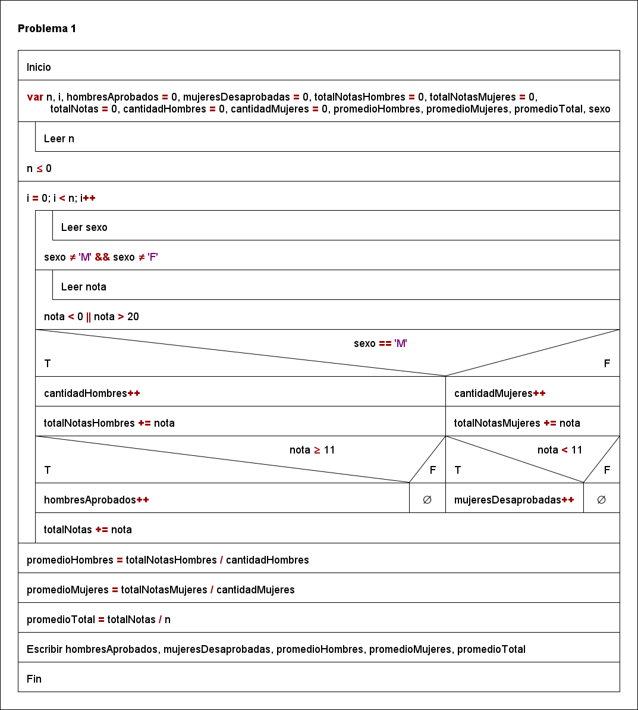
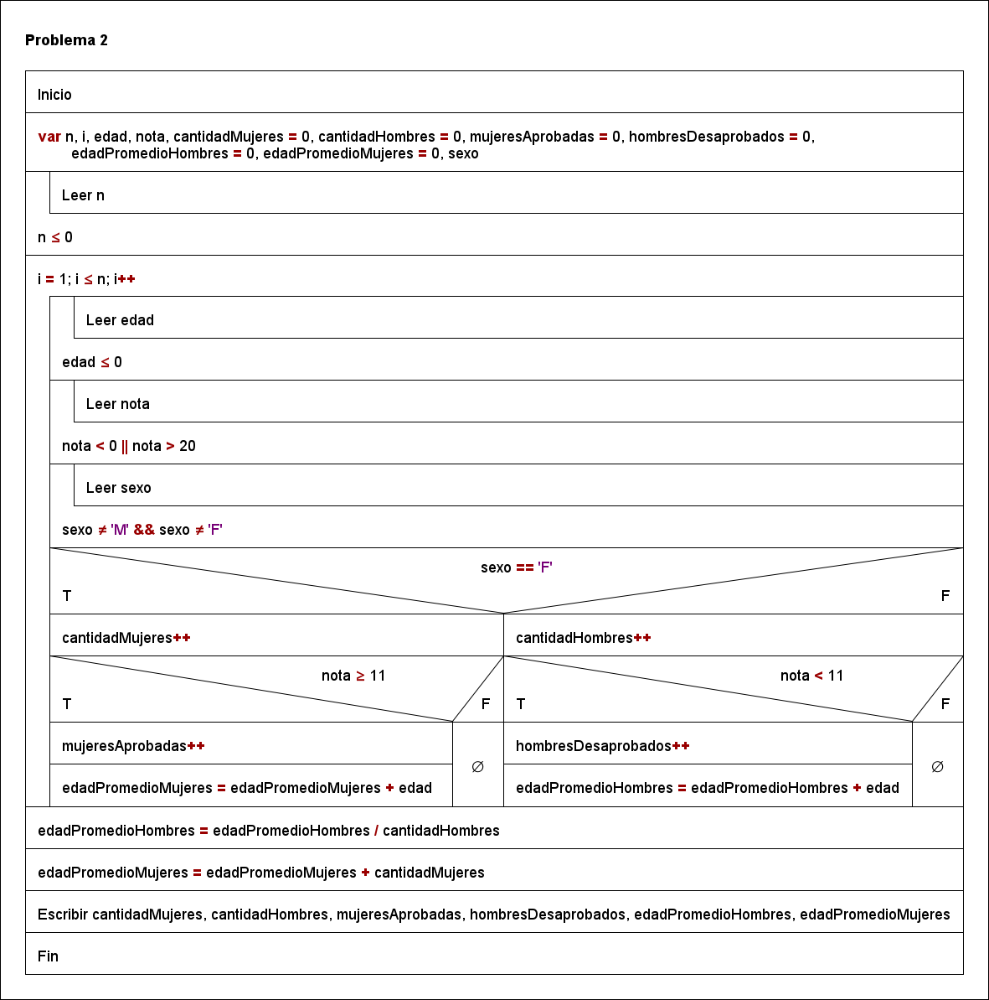
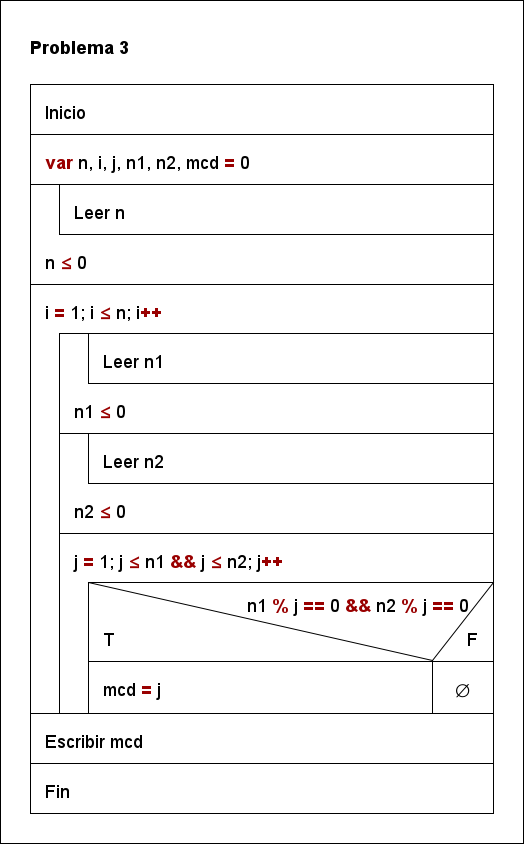
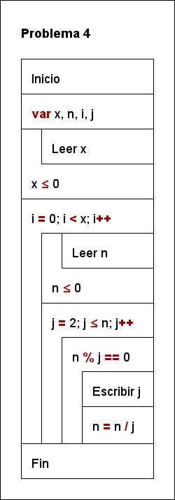
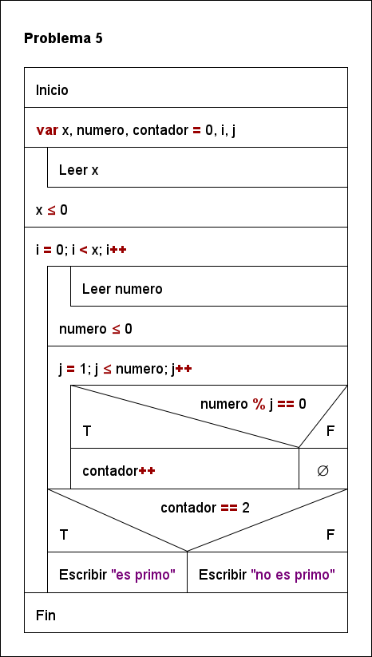
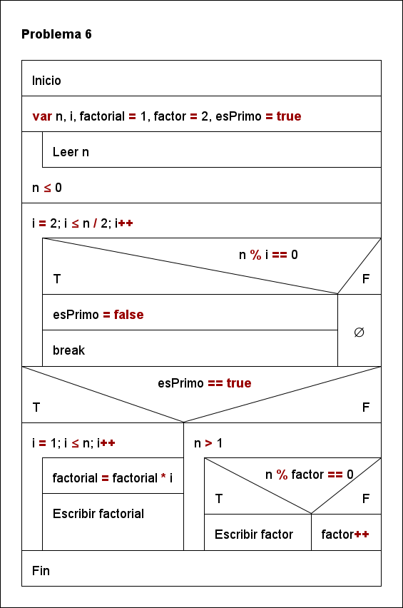
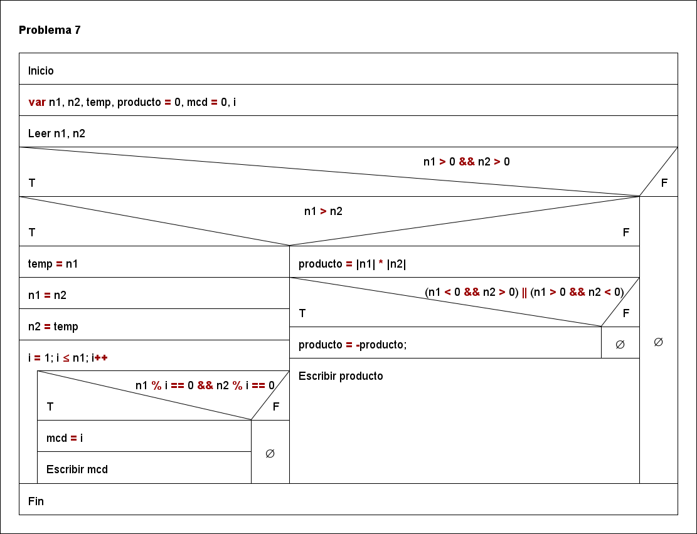
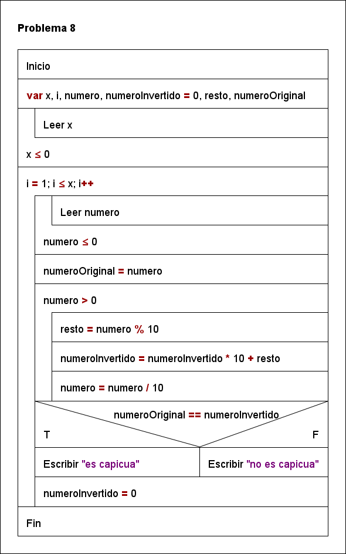
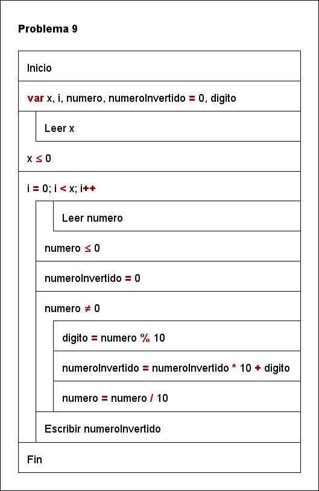
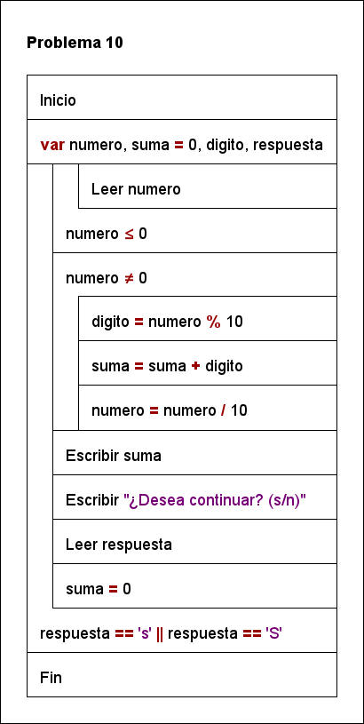

# ALGORITMOS REPETITIVOS 2 📕

Presentar **informe**, que incluye para cada pregunta, **análisis del problema, diseño de un algoritmo utilizando diagrama N-S y código en java.**

[](https://unsplash.com/photos/04X1Yp9hNH8/download?force=true&w=1080)

## Ejercicio 1

1. Programa que lee nota y sexo (M, F) de N alumnos y reporta:
   - Cantidad de hombres aprobados
   - Cantidad de mujeres desaprobadas
   - Nota promedio de hombres
   - Nota promedio de mujeres
   - Nota promedio total.

- Análisis del problema:

  - **Datos de entrada:** n, sexo, nota
  - **Datos de salida:** hombresAprobados, mujeresDesaprobadas, promedioHombres, promedioMujeres, promedioTotal
  - **Proceso:**

- Diagrama N-S:

  

- Código en java:

```java
// importamos la clase Scanner
import java.util.Scanner;

public class ejercicio1 {

  public static void main(String[] args) {
    // creamos un objeto de la clase Scanner
    Scanner sc = new Scanner(System.in);

    // declaramos las variables
    int n, i, hombresAprobados = 0, mujeresDesaprobadas = 0, totalNotasHombres = 0, totalNotasMujeres = 0,
        totalNotas = 0, cantidadHombres = 0, cantidadMujeres = 0;
    double promedioHombres, promedioMujeres, promedioTotal;
    char sexo;

    // leemos la cantidad de alumnos
    System.out.print("Ingrese la cantidad de alumnos: ");
    n = sc.nextInt();

    // validamos que la cantidad de alumnos sea mayor a 0
    while (n <= 0) {
      System.out.println("\n\u001B[31mERROR: La cantidad de alumnos debe ser mayor a 0. Inténtelo de nuevo.\u001B[0m");
      System.out.print("Ingrese la cantidad de alumnos: ");
      n = sc.nextInt();
    }

    // iteramos n veces
    for (i = 0; i < n; i++) {
      // leemos la nota y el sexo del alumno
      System.out.printf("Ingrese el sexo del alumno %d (M o F): ", i + 1);
      sexo = sc.next().toUpperCase().charAt(0);

      // validamos que el sexo sea M o F
      while (sexo != 'M' && sexo != 'F') {
        System.out.println("\n\u001B[31mERROR: El sexo ingresado no es válido. Inténtelo de nuevo.\u001B[0m");
        System.out.printf("Ingrese el sexo del alumno %d (M o F): ", i + 1);
        sexo = sc.next().toUpperCase().charAt(0);
      }

      System.out.printf("Ingrese la nota del alumno %d: ", i + 1);
      int nota = sc.nextInt();

      // validamos que la nota sea mayor o igual a 0 y menor o igual a 20
      while (nota < 0 || nota > 20) {
        System.out.println("\n\u001B[31mERROR: La nota ingresada no es válida. Inténtelo de nuevo.\u001B[0m");
        System.out.printf("Ingrese la nota del alumno %d: ", i + 1);
        nota = sc.nextInt();
      }

      // verificamos si el alumno es hombre o mujer y si aprobó o desaprobó
      if (sexo == 'M') {
        cantidadHombres++;
        totalNotasHombres += nota;

        // si la nota es mayor o igual a 11, el alumno aprobó
        if (nota >= 11) {
          hombresAprobados++;
        }
      } else {
        cantidadMujeres++;
        totalNotasMujeres += nota;

        // si la nota es menor a 12, la alumna desaprobó
        if (nota < 11) {
          mujeresDesaprobadas++;
        }
      }
      totalNotas += nota;
    }

    // calculamos los promedios
    promedioHombres = (double) totalNotasHombres / cantidadHombres;
    promedioMujeres = (double) totalNotasMujeres / cantidadMujeres;
    promedioTotal = (double) totalNotas / n;

    // mostramos los resultados
    System.out.println("\u001B[36m\nResultados:");
    System.out.printf("a) Cantidad de hombres aprobados: %d%n", hombresAprobados);
    System.out.printf("b) Cantidad de mujeres desaprobadas: %d%n", mujeresDesaprobadas);
    System.out.printf("c) Nota promedio de hombres: %.2f%n", promedioHombres);
    System.out.printf("d) Nota promedio de mujeres: %.2f%n", promedioMujeres);
    System.out.printf("e) Nota promedio total: %.2f%n", promedioTotal);

    // cerramos el objeto Scanner
    sc.close();
  }
}
```

- Ejecución del programa:

```bash
Ingrese la cantidad de alumnos: 3

Ingrese el sexo del alumno 1 (M o F): m
Ingrese la nota del alumno 1: 15
Ingrese el sexo del alumno 2 (M o F): f
Ingrese la nota del alumno 2: 10
Ingrese el sexo del alumno 3 (M o F): m
Ingrese la nota del alumno 3: 20

Resultados:
a) Cantidad de hombres aprobados: 2
b) Cantidad de mujeres desaprobadas: 1
c) Nota promedio de hombres: 17.50
d) Nota promedio de mujeres: 10.00
e) Nota promedio total: 15.00
```

## Ejercicio 2

2. Programa que lee edad, nota y sexo de N alumnos y reporta:
   - Cantidad de mujeres.
   - Cantidad de Hombres.
   - Cantidad de Mujeres aprobadas.
   - Cantidad de Hombres desaprobados.
   - Edad promedio de Hombres
   - Edad promedio de mujeres

- Análisis del problema:

  - **Datos de entrada:** n, edad, sexo, nota
  - **Datos de salida:** cantidadMujeres, cantidadHombres, mujeresAprobadas, hombresDesaprobados, edadPromedioHombres, edadPromedioMujeres
  - **Proceso:**

- Diagrama N-S:

  

- Código en java:

```java
// importamos la clase Scanner
import java.util.Scanner;

public class ejercicio2 {
  public static void main(String[] args) {
    // creamos un objeto de la clase Scanner
    Scanner sc = new Scanner(System.in);

    // declaramos las variables
    int n, i, edad, nota, cantidadMujeres = 0, cantidadHombres = 0, mujeresAprobadas = 0, hombresDesaprobados = 0,
        edadPromedioHombres = 0, edadPromedioMujeres = 0;
    char sexo;

    // leemos la cantidad de alumnos
    System.out.print("\nIngrese la cantidad de alumnos: ");
    n = sc.nextInt();

    // validamos que la cantidad de alumnos sea mayor a 0
    while (n <= 0) {
      System.out.println("\n\u001B[31mERROR: La cantidad de alumnos debe ser mayor a 0.\u001B[0m");
      System.out.print("Ingrese la cantidad de alumnos: ");

      n = sc.nextInt();
    }

    // iteramos n veces
    for (i = 1; i <= n; i++) {
      // leemos la edad
      System.out.print("\nIngrese la edad del alumno " + i + ": ");
      edad = sc.nextInt();

      // validamos que la edad sea mayor a 0
      while (edad <= 0) {
        System.out.println("\n\u001B[31mERROR: La edad debe ser mayor a 0.\u001B[0m");
        System.out.print("Ingrese la edad del alumno " + i + ": ");

        edad = sc.nextInt();
      }

      // leemos la nota
      System.out.print("Ingrese la nota del alumno " + i + ": ");
      nota = sc.nextInt();

      // validamos que la nota este entre 0 y 20
      while (nota < 0 || nota > 20) {
        System.out.println("\n\u001B[31mERROR: La nota debe estar entre 0 y 20.\u001B[0m");
        System.out.print("Ingrese la nota del alumno " + i + ": ");

        nota = sc.nextInt();
      }

      // leemos el sexo
      System.out.print("Ingrese el sexo del alumno " + i + " (M/F): ");
      sexo = sc.next().toUpperCase().charAt(0);

      // validamos que el sexo sea M o F
      while (sexo != 'M' && sexo != 'F') {
        System.out.println("\n\u001B[31mERROR: El sexo debe ser M o F.\u001B[0m");
        System.out.print("Ingrese el sexo del alumno " + i + " (M/F): ");

        sexo = sc.next().toUpperCase().charAt(0);
      }

      // si el sexo es F, incrementamos la cantidad de mujeres
      if (sexo == 'F') {
        cantidadMujeres++;

        // validamos que la nota sea mayor o igual a 11
        if (nota >= 11) {
          mujeresAprobadas++;
        }

        // incrementamos la edad promedio de mujeres
        edadPromedioMujeres += edad;
      } else {
        // si el sexo es M, incrementamos la cantidad de hombres
        cantidadHombres++;

        // validamos que la nota sea menor a 11
        if (nota < 11) {
          hombresDesaprobados++;
        }

        // incrementamos la edad promedio de hombres
        edadPromedioHombres += edad;
      }
    }

    // calculamos la edad promedio de hombres y mujeres
    edadPromedioHombres /= cantidadHombres;
    edadPromedioMujeres /= cantidadMujeres;

    // mostramos los resultados
    System.out.println("\u001B[36m\nResultados:");
    System.out.println("a) Cantidad de mujeres: " + cantidadMujeres);
    System.out.println("b) Cantidad de hombres: " + cantidadHombres);
    System.out.println("c) Cantidad de mujeres aprobadas: " + mujeresAprobadas);
    System.out.println("d) Cantidad de hombres desaprobados: " + hombresDesaprobados);
    System.out.println("e) Edad promedio de hombres: " + edadPromedioHombres);
    System.out.println("f) Edad promedio de mujeres: " + edadPromedioMujeres);

    // cerramos el Scanner
    sc.close();

  }
}
```

- Ejecución del programa:

```bash
Ingrese la cantidad de alumnos: 3

Ingrese la edad del alumno 1: 20
Ingrese la nota del alumno 1: 15
Ingrese el sexo del alumno 1 (M/F): m

Ingrese la edad del alumno 2: 18
Ingrese la nota del alumno 2: 10
Ingrese el sexo del alumno 2 (M/F): f

Ingrese la edad del alumno 3: 19
Ingrese la nota del alumno 3: 20
Ingrese el sexo del alumno 3 (M/F): m

Resultados:
a) Cantidad de mujeres: 1
b) Cantidad de hombres: 2
c) Cantidad de mujeres aprobadas: 0
d) Cantidad de hombres desaprobados: 0
e) Edad promedio de hombres: 19
f) Edad promedio de mujeres: 18
```

## Ejercicio 3

3. Leer 2 números enteros positivos N1, N2, y hallar reportar su MCD. El programa se debe repetir N veces.

- Análisis del problema:

  - **Datos de entrada:** n, n1, n2
  - **Datos de salida:** mcd
  - **Proceso:**

- Diagrama N-S:

  

- Código en java:

```java
// importamos la clase Scanner
import java.util.Scanner;

public class ejercicio3 {
  public static void main(String[] args) {
    // creamos un objeto de la clase Scanner
    Scanner sc = new Scanner(System.in);

    // declaramos las variables
    int n, i, j, n1, n2, mcd = 0;

    // solicitamos los datos al usuario
    System.out.print("\nIngrese la cantidad de veces que se repetirá el programa: ");
    n = sc.nextInt();

    // validamos que el número ingresado sea positivo
    while (n <= 0) {
      System.out.println("\n\u001B[31mERROR: El número ingresado debe ser positivo.\u001B[0m");
      System.out.print("Ingrese un número positivo: ");
      n = sc.nextInt();
    }

    // realizamos el cálculo y mostramos el resultado
    for (i = 1; i <= n; i++) {
      // solicitamos los datos al usuario
      System.out.print("Ingrese el primer número entero positivo: ");
      n1 = sc.nextInt();

      // validamos que el número ingresado sea positivo
      while (n1 <= 0) {
        System.out.println("ERROR: El número ingresado debe ser positivo.");
        System.out.print("Ingrese un número positivo: ");
        n1 = sc.nextInt();
      }

      // solicitamos los datos al usuario
      System.out.print("Ingrese el segundo número entero positivo: ");
      n2 = sc.nextInt();

      // validamos que el número ingresado sea positivo
      while (n2 <= 0) {
        System.out.println("ERROR: El número ingresado debe ser positivo.");
        System.out.print("Ingrese un número positivo: ");
        n2 = sc.nextInt();
      }

      // realizamos el cálculo
      for (j = 1; j <= n1 && j <= n2; j++) {
        if (n1 % j == 0 && n2 % j == 0) {
          mcd = j;
        }
      }

      // mostramos el resultado
      System.out.println("\u001B[36m\nResultado:");
      System.out.println("El MCD de " + n1 + " y " + n2 + " es " + mcd);
      System.out.println("\u001B[0m");
    }

    // cerramos el objeto Scanner
    sc.close();
  }
}
```

- Ejecución del programa:

```bash
Ingrese la cantidad de veces que se repetirá el programa: 2

Ingrese el primer número entero positivo: 12
Ingrese el segundo número entero positivo: 18

Resultado:
El MCD de 12 y 18 es 6

Ingrese el primer número entero positivo: 15
Ingrese el segundo número entero positivo: 20

Resultado:
El MCD de 15 y 20 es 5
```

## Ejercicio 4

4. Programa que permite leer un número N entero positivo y lo descompone en sus factores primos. El programa se debe repetir X veces.
   Ejemplo: Si X= 4, entonces se repite 4 veces: 6 = 23 , 20=225 , 15= 35 , 24=222\*3

- Análisis del problema:

  - **Datos de entrada:** n, x
  - **Datos de salida:** factores primos
  - **Proceso:**

- Diagrama N-S:

  

- Código en java:

```java
// importamos la clase Scanner
import java.util.Scanner;

public class ejercicio4 {
  public static void main(String[] args) {
    // creamos un objeto de la clase Scanner
    Scanner sc = new Scanner(System.in);

    // declaramos las variables
    int x, n, i, j;

    // leemos el número de veces que se va a repetir el programa
    System.out.print("Introduce el número de veces que se va a repetir el programa: ");
    x = sc.nextInt();

    // validamos que el número de veces sea mayor que 0
    while (x <= 0) {
      System.out.println("\n\u001B[31mERROR:El número de veces debe ser mayor que 0\u001B[0m");
      System.out.print("Introduce el número de veces que se va a repetir el programa: ");
      x = sc.nextInt();
    }

    // bucle que se repite x veces
    for (i = 0; i < x; i++) {
      // leemos el número
      System.out.print("\nIntroduce un número entero positivo: ");
      n = sc.nextInt();

      // validamos que el número sea mayor que 0
      while (n <= 0) {
        System.out.println("\nEl número debe ser mayor que 0");
        System.out.print("Introduce un número entero positivo: ");
        n = sc.nextInt();
      }

      System.out.print("La factorización en números primos de " + n + " es = ");

      // bucle que se repite mientras n sea divisible entre j
      for (j = 2; j <= n; j++) {
        while (n % j == 0) {
          System.out.print(j);
          n = n / j;
          if (n != 1) {
            System.out.print(" * ");
          }
        }
      }

      System.out.println();
    }
  }
}
```

- Ejecución del programa:

```bash
Introduce el número de veces que se va a repetir el programa: 2

Introduce un número entero positivo: 6

Resultado:
6 = 2 * 3

Introduce un número entero positivo: 24

Resultado:
24 = 2 * 2 * 2 * 3
```

## Ejercicio 5

5. Leer X números y para cada uno indicar si es primo o no lo es.

- Análisis del problema:

  - **Datos de entrada:** x, numero
  - **Datos de salida:** si es primo o no
  - **Proceso:**

- Diagrama N-S:

  

- Código en java:

```java
// importamos la libreria Scanner
import java.util.Scanner;

public class ejercicio5 {
  public static void main(String[] args) {
    // creamos el objeto Scanner
    Scanner sc = new Scanner(System.in);

    // declaramos las variables
    int x, numero, contador = 0;

    // leemos el número de veces que se va a repetir el programa
    System.out.print("Introduce el número de veces que se va a repetir el programa: ");
    x = sc.nextInt();

    // validamos que el número de veces sea mayor que 0
    while (x <= 0) {
      System.out.println("\n\u001B[31mERROR:El número de veces debe ser mayor que 0\u001B[0m");
      System.out.print("Introduce el número de veces que se va a repetir el programa: ");
      x = sc.nextInt();
    }

    // bucle para repetir el programa
    for (int i = 0; i < x; i++) {
      // leemos el número
      System.out.print("\nIntroduce un número: ");
      numero = sc.nextInt();

      // validamos que el número sea mayor que 0
      while (numero <= 0) {
        System.out.println("\nEl número debe ser mayor que 0");
        System.out.print("Introduce un número: ");
        numero = sc.nextInt();
      }

      // bucle para comprobar si el número es primo
      for (int j = 1; j <= numero; j++) {
        if (numero % j == 0) {
          contador++;
        }
      }

      // mostramos el resultado
      if (contador == 2) {
        System.out.println("\u001B[36mEl número " + numero + " es primo\u001B[0m");
      } else {
        System.out.println("\u001B[36mEl número " + numero + " no es primo\u001B[0m");
      }

      // reiniciamos el contador
      contador = 0;
    }

    // cerramos el Scanner
    sc.close();
  }
}
```

- Ejecución del programa:

```bash
Introduce el número de veces que se va a repetir el programa: 2

Introduce un número: 5
El número 5 es primo

Introduce un número: 6
El número 6 no es primo
```

## Ejercicio 6

6. Leer un número N entero positivo. Si N es primo, calcular su factorial, en caso contrario descomponerlo en sus factores primos.

- Análisis del problema:

  - **Datos de entrada:** n
  - **Datos de salida:** factorial o esPrimo
  - **Proceso:**

- Diagrama N-S:

  

- Código en java:

```java
// importamos la clase Scanner
import java.util.Scanner;

public class ejercicio6 {

  public static void main(String[] args) {
    // creamos un objeto de la clase Scanner
    Scanner sc = new Scanner(System.in);

    // declaramos las variables
    int n, i, factorial = 1, factor = 2;
    boolean esPrimo = true;

    System.out.print("Ingrese un número entero positivo: ");
    n = sc.nextInt();

    while (n <= 0) {
      System.out.println("\n\u001B[31mERROR: El número ingresado debe ser positivo.\u001B[0m");
      System.out.print("Ingrese un número entero positivo: ");
      n = sc.nextInt();
    }

    for (i = 2; i <= Math.sqrt(n); i++) {
      if (n % i == 0) {
        esPrimo = false;
        break;
      }
    }

    if (esPrimo) {
      System.out.println("\u001B[36m\nResultado:");
      System.out.println(n + " es primo");
      System.out.print(n + "! = ");

      for (i = 1; i <= n; i++) {
        factorial *= i;
      }

      System.out.println(factorial);
    } else {
      System.out.println("\u001B[36m\nResultado:");
      System.out.println(n + " no es primo");
      System.out.print(n + " = ");

      while (n > 1) {
        if (n % factor == 0) {
          System.out.print(factor);
          n /= factor;
          if (n != 1) {
            System.out.print(" x ");
          }
        } else {
          factor++;
        }
      }
    }

    // cerramos el Scanner
    sc.close();
  }
}
```

- Ejecución del programa:

```bash
Ingrese un número entero positivo: 5

Resultado:
5 es primo
5! = 120

Ingrese un número entero positivo: 6

Resultado:
6 no es primo
6 = 2 x 3
```

## Ejercicio 7

7. Leer 2 números enteros N1 y N2 (cada uno de los cuales puede ser positivo, negativo y/o cero). Si ambos números son positivos calcular el MCD de N1 y N2. Sino calcular el producto de N1 \* N2 por sumas sucesivas.

- Análisis del problema:

  - **Datos de entrada:** n1, n2
  - **Datos de salida:** mcd o producto
  - **Proceso:**

- Diagrama N-S:

  

- Código en java:

```java
// importamos la clase Scanner
import java.util.Scanner;

public class ejercicio7 {
  public static void main(String[] args) {
    // creamos un objeto de la clase Scanner
    Scanner sc = new Scanner(System.in);

    // declaramos las variables
    int n1, n2, temp, producto = 0, mcd = 0, i;

    // solicitamos los datos al usuario
    System.out.print("Ingresa el primer número: ");
    n1 = sc.nextInt();

    System.out.print("Ingresa el segundo número: ");
    n2 = sc.nextInt();

    // cerramos el objeto Scanner
    sc.close();

    // comprobamos si los números son positivos
    if (n1 > 0 && n2 > 0) {
      // comprobamos cual es el mayor de los dos números
      if (n1 > n2) {
        temp = n1;
        n1 = n2;
        n2 = temp;
      }

      // calculamos el MCD
      for (i = 1; i <= n1; i++) {
        if (n1 % i == 0 && n2 % i == 0) {
          mcd = i;
        }
      }

      System.out.println("El MCD de " + n1 + " y " + n2 + " es: " + mcd);
    } else {
      // calculamos el producto
      producto = Math.abs(n1) * Math.abs(n2);

      // comprobamos si el producto es negativo
      if ((n1 < 0 && n2 > 0) || (n1 > 0 && n2 < 0)) {
        producto = -producto;
      }

      System.out.println("El producto de " + n1 + " y " + n2 + " es: " + producto);
    }
  }
}
```

- Ejecución del programa:

```bash
Ingresa el primer número: 5
Ingresa el segundo número: 6
El MCD de 5 y 6 es: 1

Ingresa el primer número: -5
Ingresa el segundo número: 6
El producto de -5 y 6 es: -30
```

## Ejercicio 8

8. Escribir un programa que lea X números enteros positivos y determine para cada uno si es capicúa o no lo es. Un número capicúa es aquel que se lee igual de izquierda a derecha y de derecha a izquierda.

- Análisis del problema:

  - **Datos de entrada:** numero
  - **Datos de salida:** capicua
  - **Proceso:**

- Diagrama N-S:

  

- Código en java:

```java
// importamos la clase Scanner
import java.util.Scanner;

public class ejercicio8 {
  public static void main(String[] args) {
    // creamos un objeto de la clase Scanner
    Scanner sc = new Scanner(System.in);

    // declaramos las variables
    int numero, numeroInvertido = 0, resto, numeroOriginal;

    // solicitamos los datos al usuario
    System.out.print("Ingresa un número: ");
    numero = sc.nextInt();

    // comprobamos si el número es positivo
    while (numero <= 0) {
      System.out.println("\n\u001B[31mERROR: El número debe ser positivo.\u001B[0m");
      System.out.print("Ingresa un número: ");
      numero = sc.nextInt();
    }

    // cerramos el objeto Scanner
    sc.close();

    // guardamos el número original
    numeroOriginal = numero;

    // invertimos el número
    while (numero > 0) {
      resto = numero % 10;
      numeroInvertido = numeroInvertido * 10 + resto;
      numero /= 10;
    }

    // comprobamos si el número es capicúa
    if (numeroOriginal == numeroInvertido) {
      System.out.println("El número " + numeroOriginal + " es capicúa");
    } else {
      System.out.println("El número " + numeroOriginal + " no es capicúa");
    }
  }
}
```

- Ejecución del programa:

```bash
Ingresa un número: 12321
El número 12321 es capicúa

Ingresa un número: 12345
El número 12345 no es capicúa
```

## Ejercicio 9

9. Programa que permite leer un número entero positivo y lo escribe al revés. El programa se debe repetir X veces.

- Análisis del problema:

  - **Datos de entrada:** numero
  - **Datos de salida:** numeroReverso
  - **Proceso:**

- Diagrama N-S:

  

- Código en java:

```java
// importamos la clase Scanner
import java.util.Scanner;

public class ejercicio9 {
  public static void main(String[] args) {
    // creamos un objeto de la clase Scanner
    Scanner sc = new Scanner(System.in);

    // declaramos las variables
    int veces, numero;
    StringBuilder numeroReverso = new StringBuilder();

    // solicitamos los datos al usuario
    System.out.print("Ingrese la cantidad de veces que desea repetir el programa: ");
    veces = sc.nextInt();

    // comprobamos si la cantidad de veces es positiva
    while (veces <= 0) {
      System.out.println("\n\u001B[31mERROR: La cantidad de veces debe ser positiva.\u001B[0m");
      System.out.print("Ingrese la cantidad de veces que desea repetir el programa: ");
      veces = sc.nextInt();
    }

    // repetimos el programa la cantidad de veces indicada por el usuario
    for (int i = 1; i <= veces; i++) {
      System.out.print("Ingrese un número entero positivo: ");
      numero = sc.nextInt();

      // comprobamos si el número es positivo
      while (numero <= 0) {
        System.out.println("\n\u001B[31mERROR: El número debe ser positivo.\u001B[0m");
        System.out.print("Ingrese un número entero positivo: ");
        numero = sc.nextInt();
      }

      if (numero <= 0) {
        System.out.println("El número ingresado no es válido. Por favor, ingrese un número entero positivo.");
      } else {
        String.valueOf(numero);
        numeroReverso.reverse();

        // Agregar ceros a la izquierda
        while (numeroReverso.length() < String.valueOf(numero).length()) {
          numeroReverso.append("0");
        }

        System.out.println("El número al revés es: " + numeroReverso.toString());
      }
    }

    sc.close();
  }
}
```

- Ejecución del programa:

```bash
Ingrese la cantidad de veces que desea repetir el programa: 2
Ingrese un número entero positivo: 123
El número al revés es: 321
Ingrese un número entero positivo: 1234
El número al revés es: 4321
```

## Ejercicio 10

10. Programa que lee un número entero positivo y determina la suma de sus dígitos. El programa se debe repetir mientras se desee continuar.

- Análisis del problema:

  - **Datos de entrada:** numero
  - **Datos de salida:** suma
  - **Proceso:**

- Diagrama N-S:

  

- Código en java:

```java
// importamos la clase Scanner
import java.util.Scanner;

public class ejercicio10 {
  public static void main(String[] args) {
    // creamos un objeto de la clase Scanner
    Scanner sc = new Scanner(System.in);

    // declaramos las variables
    int numero, suma = 0, digito;
    char respuesta;

    // repetimos el programa mientras el usuario lo desee
    do {
      System.out.print("Introduzca un número entero positivo: ");
      numero = sc.nextInt();

      // comprobamos si el número es positivo
      while (numero <= 0) {
        System.out.println("\n\u001B[31mERROR: El número debe ser positivo.\u001B[0m");
        System.out.print("Introduzca un número entero positivo: ");
        numero = sc.nextInt();
      }

      // comprobamos si el número es positivo
      while (numero != 0) {
        digito = numero % 10;
        suma = suma + digito;
        numero = numero / 10;
      }

      // mostramos el resultado
      System.out.println("La suma de sus dígitos es: " + suma);
      System.out.print("¿Desea continuar? (s/n): ");

      respuesta = sc.next().charAt(0);

      // reiniciamos la variable suma
      suma = 0;
    } while (respuesta == 's' || respuesta == 'S');

    // cerramos el objeto Scanner
    sc.close();
  }
}
```

- Ejecución del programa:

```bash
Introduzca un número entero positivo: 123
La suma de sus dígitos es: 6
¿Desea continuar? (s/n): s

Introduzca un número entero positivo: 1234
La suma de sus dígitos es: 10
¿Desea continuar? (s/n): n
```
